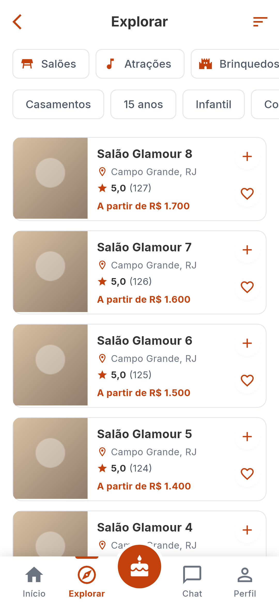
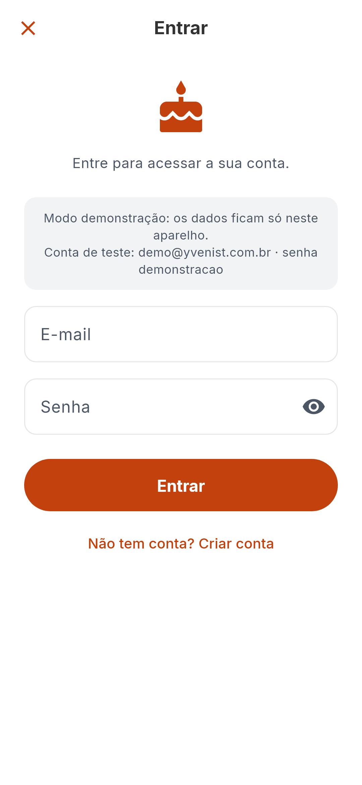
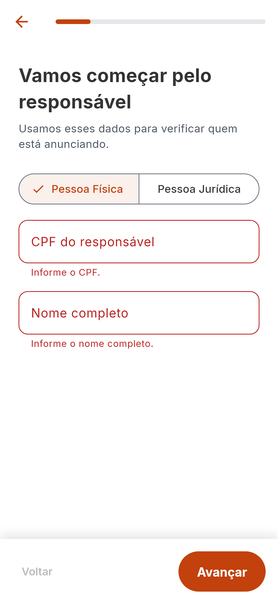
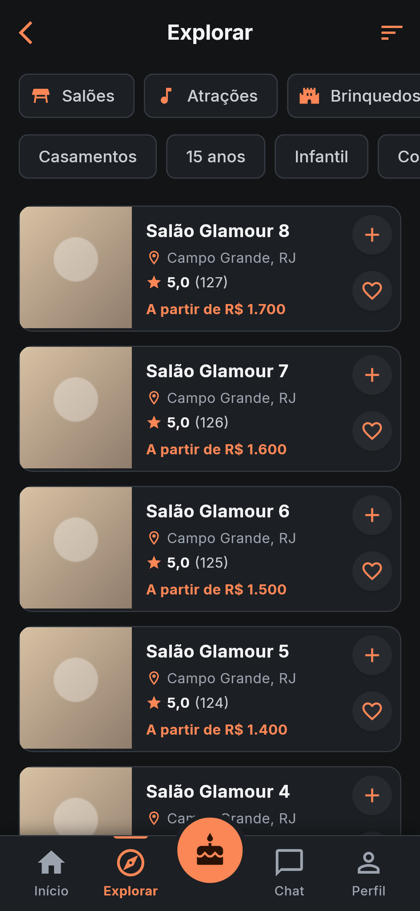
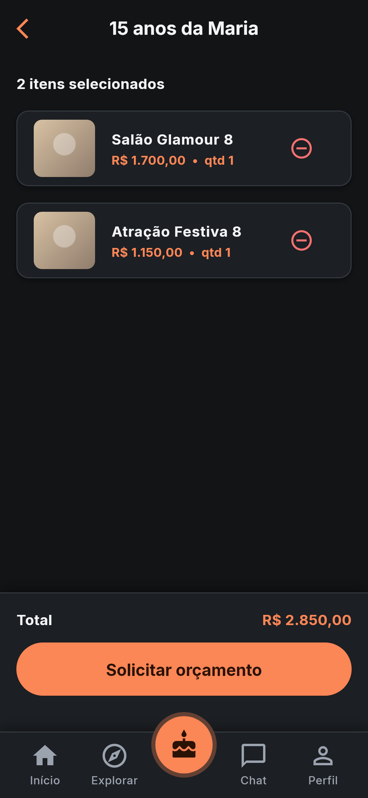
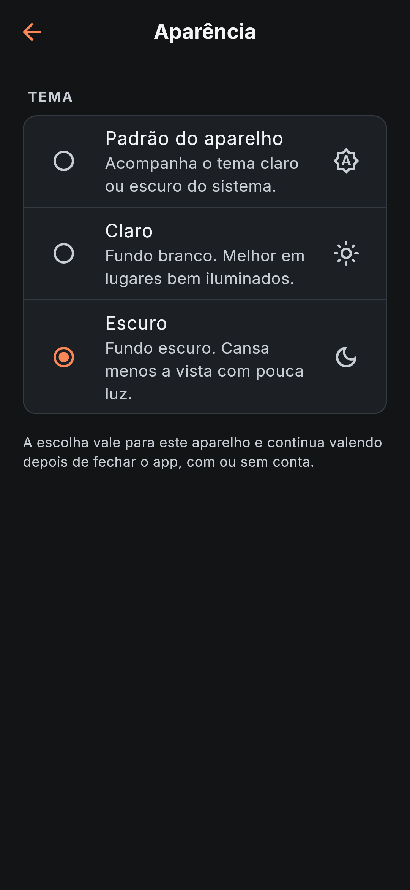

# Yvenist 🎉

### The All-in-One Marketplace for Events & Parties

> Connecting people who want to celebrate with the best venues and service providers — all in one place.

---

## 📱 About

**Yvenist** is a marketplace dedicated to the events and parties sector, inspired by Airbnb's model. Instead of searching for venues on Google and collecting quotes over WhatsApp, the organizer discovers venues and services, assembles the whole party in one place and requests a single quote. Suppliers register their business, go through a review step and get their listings published.

The repository holds two pieces:

| Piece | Where | What it is |
|---|---|---|
| **App** | `lib/` | Flutter app (Android, iOS, web) for clients and suppliers |
| **API** | `backend/` | FastAPI + PostgreSQL service the app talks to |

The app also runs **without the API**, in *demo mode*, with sample data kept in memory. That is the default: `flutter run` is enough to see every screen working.

---

## ✅ What works today

| Area | Status |
|---|---|
| Browse the catalog: home showcase, categories, event types, sorting, infinite scroll | Working |
| Search by text (ignores accents and capitalization) | Working |
| Accounts: sign up, sign in, restore session, edit profile, change password, delete account | Working |
| Favorites, synced per account | Working |
| **Party Maker**: build a party from listings, running total, request a quote (locks the party), unlock to edit | Working |
| Supplier onboarding: 6-step venue registration with CPF/CNPJ validation | Working |
| Review pipeline: suppliers and listings are published only after approval | Working: administrators approve or reject from a review queue in the app |
| Client / Supplier mode switch on the Profile tab | Working (supplier mode shows listing counters) |
| Light and dark themes | Working: follows the device by default; the user can pick one in Profile → Appearance, and the choice is kept on the device |
| Terms of Use and Privacy Policy | Preliminary texts shown in the app; legal review still pending |

### 🚧 Planned, not built yet

The app shows these as "Em breve" ("coming soon") instead of pretending they exist:

- Payments, payment history and payouts
- Chat between clients and suppliers
- Reviews and ratings written by users
- Notifications
- Listing photos upload, availability calendar, listing details page
- Two-factor authentication and the "connected devices" screen (the API already lists and revokes sessions)
- Supplier registration for categories other than venues
- Sending the quote to suppliers (today it is an estimate for the organizer only)

---

## 📸 Screenshots

Generated from the real screens by an automated test (`test/visual/screenshots_test.dart`), so they never drift from the code.

| Home | Explore | Party Maker | Profile |
|---|---|---|---|
|  |  |  |  |

| Add to a party | Sign in | Supplier invitation | Supplier form |
|---|---|---|---|
|  |  |  |  |

The same test renders every screen in the dark theme too:

| Home | Explore | Party Maker | Appearance |
|---|---|---|---|
|  |  |  |  |

---

## 🛠️ Tech Stack

| Layer | Technology |
|---|---|
| App | Flutter 3.41 · Dart 3.11 |
| App state | Provider + `ChangeNotifier` controllers |
| App networking | `http`, tokens in the system keystore (`flutter_secure_storage`) |
| API | Python 3.14 · FastAPI · Pydantic 2 |
| Persistence | SQLAlchemy 2 · Alembic migrations · PostgreSQL 17 (SQLite for local development) |
| Authentication | Short-lived JWT access token + rotating refresh token, Argon2id password hashing |
| Quality | `flutter analyze` (strict), `ruff`, `mypy --strict`, GitHub Actions |

---

## 🚀 Getting Started

### Demo mode (no backend)

```bash
git clone https://github.com/KevenSanchesG/Yvenist.git
cd Yvenist
flutter pub get
flutter run
```

The app opens signed in with a demo account. After signing out, use `demo@yvenist.com.br` / `demonstracao`. Everything lives in memory and is reset when the app restarts.

### With the API

```bash
# 1. Start the API (details and Docker option in backend/README.md)
cd backend
python -m venv .venv
.venv\Scripts\activate                 # Linux/macOS: source .venv/bin/activate
pip install -r requirements-dev.txt
alembic upgrade head
python -m app.cli seed-demo            # sample listings
uvicorn app.main:get_app --factory

# 2. Run the app pointing at it
cd ..
flutter run --dart-define=API_BASE_URL=http://10.0.2.2:8000/api/v1    # Android emulator
flutter run --dart-define=API_BASE_URL=http://127.0.0.1:8000/api/v1   # web / desktop
```

`10.0.2.2` is how the Android emulator reaches the computer it runs on. Plain `http` is accepted only in debug builds; a release build refuses an `API_BASE_URL` that is not `https`.

---

## 🧪 Tests

```bash
flutter analyze
flutter test                         # units, widget flows, accessibility
python tools/check_docs.py           # links and structure of the knowledge base

cd backend
pytest                               # the API on in-memory SQLite
ruff check . && mypy app tests
```

| Suite | What it proves |
|---|---|
| App unit tests | Domain rules, controllers, repositories (API ones against a fake HTTP layer) |
| App flow tests | The whole app in demo mode on a phone-sized screen: browse, search, sign in, build a party, supplier onboarding |
| Accessibility tests | 48×48 touch targets, labels for screen readers, color contrast (WCAG AA) in both themes, no layout overflow with the system font at 200% or in the dark theme |
| Backend tests | Every endpoint, the party rules, migrations equal to the models |
| Backend on PostgreSQL | Same suite plus truly simultaneous requests: `YVENIST_TEST_DATABASE_URL=postgresql+psycopg://... pytest` |
| Integration tests | The real app code against a running API: `YVENIST_API_URL=http://127.0.0.1:8000/api/v1 flutter test --tags integration test/integration` |
| Integration tests in the browser | The same scenarios inside Chrome, which is what exercises CORS and the web HTTP client (CI only) |

CI (`.github/workflows/ci.yml`) runs all of the above on every push to any branch, builds the Android APK and boots the Docker image. Current numbers and what was verified where are in the [changelog](docs/08-changelog/README.md).

---

## 🏗️ Architecture

Feature-first folders with Clean Architecture layers inside each feature; the screens depend on repository *contracts*, and one composition root decides whether they are served by the API or by the in-memory demo data.

```
lib/
  app/        composition root, app-wide state, shell with the bottom navigation
  core/       config, HTTP client, token storage, theme, shared widgets, errors
  features/
    auth/          session, sign in, sign up
    catalog/       listings, categories, search (domain + data)
    client/        home, explore, search, favorites, profile screens
    party_maker/   the party aggregate, its rules and screens
    vendor/        supplier registration and status
    admin/         review queue for administrators
    shared_features/  legal, security, and the "coming soon" screens
backend/      the API (see backend/README.md)
deploy/       production recipe: the API behind a reverse proxy with automatic HTTPS
docs/         the project knowledge base (also an Obsidian vault)
test/         unit, widget-flow, accessibility and integration tests
tools/        check_docs.py, the knowledge base checker
```

## 📚 Documentation

Developer documentation is written in Portuguese, like the code comments. It lives in `docs/`, a knowledge base in plain Markdown that also opens as an [Obsidian](https://obsidian.md) vault:

- [`docs/00-project/memory-system.md`](docs/00-project/memory-system.md) — **start here**: the index of everything, and how the project memory works
- [`docs/01-architecture/overview.md`](docs/01-architecture/overview.md) — how the app and the API are organized
- [`docs/03-features/party-maker/README.md`](docs/03-features/party-maker/README.md) — the Party Maker: domain, rules, flows
- [`docs/05-decisions/README.md`](docs/05-decisions/README.md) — why each choice was made (ADRs)
- [`docs/07-known-issues/README.md`](docs/07-known-issues/README.md) — what is missing, limited or not verified
- [`docs/09-guides/deployment.md`](docs/09-guides/deployment.md) — putting the API in production, with HTTPS
- [`docs/09-guides/android-release.md`](docs/09-guides/android-release.md) — signing and publishing checklist
- [`backend/README.md`](backend/README.md) — running, configuring and testing the API

`CLAUDE.md` and `.claude/` hold the instructions an AI coding assistant ([Claude Code](https://claude.com/claude-code)) loads when working on this repository.

---

## 👨‍💻 Author

**Keven Gualandi**
CS Student @ UERJ | Flutter & Python Developer

[](https://linkedin.com/in/keven-gualandi)
[](https://github.com/KevenSanchesG)

---

## 📄 License

This project is currently in stealth mode. All rights reserved.
