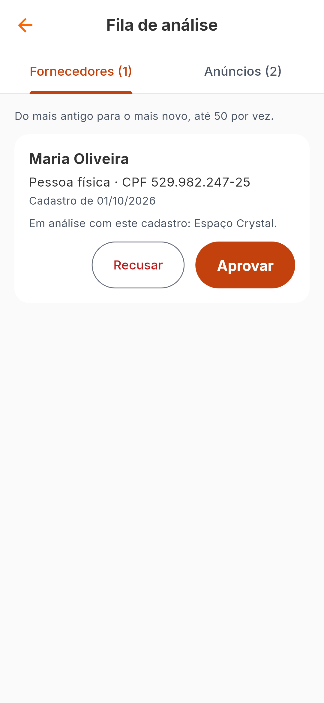
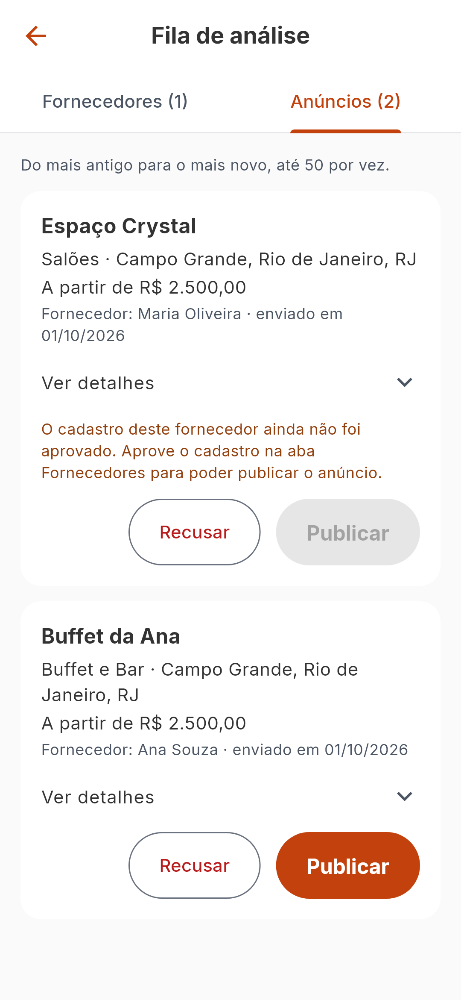

# Fila de análise (administração)

Regras: [vendors-and-review](../02-domain/vendors-and-review.md). Motivo das
escolhas: [ADR-010](../05-decisions/ADR-010-fila-de-analise.md).

## Quem vê

Só contas com `isAdmin`. Para elas o Perfil mostra a seção **Administração →
Fila de análise**. As outras contas nunca veem a entrada, e o servidor recusa
as chamadas de qualquer forma (403).

Um administrador é criado pela linha de comando, nunca pelo app:
`python -m app.cli create-admin --email voce@dominio`.

## A tela

`lib/features/admin/presentation/pages/review_queue_page.dart`. Duas abas, com a
quantidade de cada uma; do mais antigo para o mais novo; até 50 por vez.

 

| Aba | Cada cartão mostra | Ações |
|---|---|---|
| Fornecedores | nome, pessoa física/jurídica, **CPF/CNPJ completo**, data do cadastro, os anúncios que aguardam com ele | Recusar, Aprovar |
| Anúncios | título, categoria, local, preço, fornecedor e data; "Ver detalhes" abre descrição, capacidade, área, eventos, estrutura e cancelamento | Recusar, Publicar |

## Decisões

| Ação | O que pede | O que acontece |
|---|---|---|
| Aprovar cadastro | confirmação, com a opção "Publicar também o anúncio …" | o cadastro é aprovado; com a opção marcada, os anúncios dele são publicados |
| Recusar cadastro | o motivo (5 a 500 caracteres); avisa que os anúncios do cadastro também são recusados | cadastro e anúncios pendentes recusados com o mesmo motivo |
| Publicar anúncio | confirmação | entra no catálogo |
| Recusar anúncio | o motivo | o fornecedor lê o motivo |

- **Publicar fica desabilitado** enquanto o cadastro do fornecedor não foi
  aprovado, com a explicação no cartão.
- A aprovação só publica junto **o que apareceu na tela**: sem anúncios à vista,
  o app manda `publish_pending_listings: false`.
- Depois de qualquer decisão, tendo dado certo ou não, a fila é recarregada. Se
  outra pessoa já tinha decidido, aparece "Este item já foi analisado." e o
  item sai da tela.

## Código

| Parte | Arquivo |
|---|---|
| Contrato | `lib/features/admin/domain/review_repository.dart` |
| Modelos | `…/domain/review_models.dart` (`VendorReview`, `ListingReview`, `ReviewQueue`) |
| API | `…/data/api_review_repository.dart` |
| Memória | `…/data/in_memory_review_repository.dart` |
| Estado | `…/presentation/controllers/review_queue_controller.dart` |

Os nomes de categoria e de tipo de evento vêm do catálogo; se a consulta
falhar, a tela mostra as chaves e continua utilizável.

## Testes

`test/features/admin/review_test.dart`, `test/app/admin_flow_test.dart`,
verificação de acessibilidade e de fonte em 200%, e três cenários em
`test/integration/` (aprovar, recusar e reenviar, publicar um a um).

## O que não existe

Paginação da fila, histórico do que já foi decidido, busca, despublicar um
anúncio, gestão de contas, e qualquer administração de catálogo (categorias,
tipos de evento).
