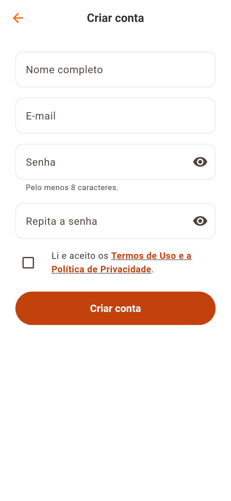

# Conta — entrar, criar, editar, segurança

Regras: [accounts](../02-domain/accounts.md). Motivos: [ADR-004](../05-decisions/ADR-004-autenticacao.md).

## Telas

| Tela | Arquivo | O que faz |
|---|---|---|
| Entrar | `auth/presentation/pages/login_page.dart` | e-mail e senha; no modo demonstração informa a conta de teste |
| Criar conta | `auth/presentation/pages/register_page.dart` | nome, e-mail, senha, repetir senha e o aceite dos termos (com link para lê-los) |
| Perfil | `client/profile/presentation/pages/profile_page.dart` | cabeçalho com nome e e-mail, seletor Cliente/Fornecedor, contadores, menus |
| Dados Pessoais | `client/profile/presentation/pages/personal_data_page.dart` | nome, telefone, data de nascimento; o e-mail aparece e não pode ser mudado |
| Segurança | `shared_features/security/presentation/pages/security_page.dart` | alterar senha; excluir conta (pede a senha) |

  

## Como o login é pedido

Navegar não exige conta. Quando uma ação exige (favoritar, montar festa, abrir
as abas "Minhas festas" e "Perfil"), `ensureSignedIn` abre a tela de entrada
com o motivo ("Entre para salvar seus favoritos."). Depois de entrar, **a ação
que a pessoa tinha pedido continua**.

## Comportamentos que valem conhecer

- **Erros por campo**: quando a API recusa um campo (e-mail já usado, senha
  comum), a mensagem aparece no próprio campo (`forceErrorText`), não em um
  aviso genérico. Editar o formulário limpa o erro.
- **Sair** pede confirmação e volta ao Início como visitante.
- **Sair com alterações não salvas** em Dados Pessoais pergunta "Descartar
  alterações?".
- **Trocar a senha** encerra as sessões nos outros aparelhos.
- **Excluir a conta** apaga festas, favoritos e, se houver, o cadastro de
  fornecedor e os anúncios.
- **Abrir o app sem rede** mantém a sessão guardada; a tela avisa e deixa
  tentar de novo.
- **Sessão expirada no meio do uso**: o app volta a ser visitante e os dados da
  conta somem da tela.
- O botão do olho no campo de senha fica fora da ordem de foco: o "próximo" do
  teclado vai para o campo seguinte (`form_widgets.dart`).

## O perfil

Menus com o que existe e o que é "Em breve". Para administradores aparece a
seção **Administração** ([admin-review](admin-review.md)). O banner de
fornecedor muda conforme a situação do cadastro
([vendor-onboarding](vendor-onboarding.md)).

## Testes

`test/features/auth/*`, `test/app/account_flow_test.dart`,
`test/core/secure_token_storage_test.dart`, `test/core/network/api_client_test.dart`.

## O que não existe

Recuperar senha, confirmar e-mail, entrar com Google/Apple, dois fatores, tela
de dispositivos conectados, mudar o e-mail, foto de perfil.
