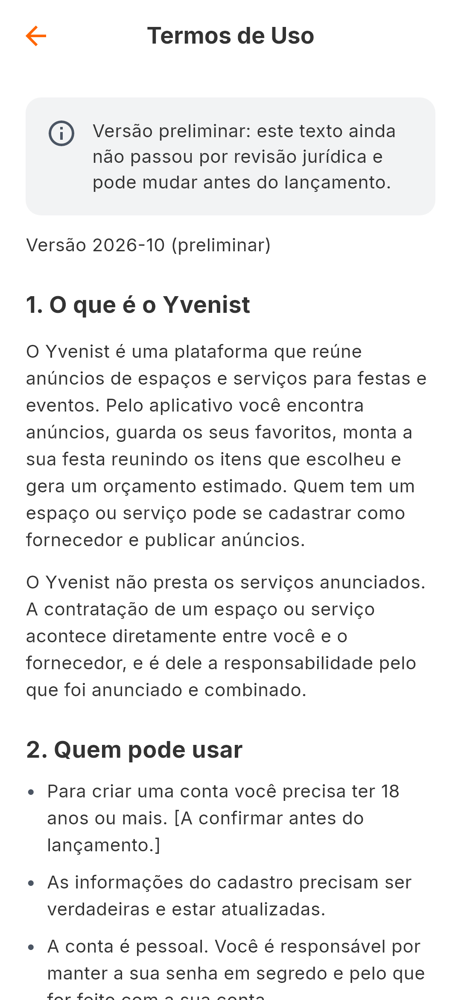

# Termos de Uso e Política de Privacidade

## Situação

**Versão preliminar.** Os textos foram escritos a partir do que o código faz
(o que cada tabela guarda, o que a exclusão apaga, o que são a estimativa e o
orçamento, o que o fornecedor recebe em um pedido) e conferidos, linha a
linha, em 2 de outubro de 2026; em 3 de outubro foram atualizados para o Party
Maker novo ([personal-data](../01-architecture/personal-data.md)). **Não
passaram por advogado.** O que depende de uma decisão dos donos está entre
colchetes no próprio texto.

| Documento | Arquivo | Onde aparece |
|---|---|---|
| Termos de Uso | `assets/legal/termos-de-uso.md` | no app, com aviso de versão preliminar; no site |
| Política de Privacidade | `assets/legal/politica-de-privacidade.md` | no app, com aviso; no site |
| Exclusão de conta | `deploy/site/exclusao-de-conta.md` | só no site |
| Contrato do Fornecedor | não existe | no app, como "Em elaboração"; as regras para fornecedores estão na seção 5 dos Termos |



## Onde aparece no app

- Perfil → Termos e Política (`legal_page.dart` → `legal_document_page.dart`).
- No cadastro: "Li e aceito os Termos de Uso e a Política de Privacidade", com
  link. Sem marcar, a conta não é criada.

## O site público

A Play Store exige a política e uma página para pedir a exclusão da conta em
**endereços públicos**. As páginas são geradas dos mesmos arquivos
([ADR-015](../05-decisions/ADR-015-paginas-legais-publicas.md)):

```bash
python tools/build_legal_site.py        # escreve em build/legal-site/
```

Saem `politica-de-privacidade.html`, `termos-de-uso.html`,
`exclusao-de-conta.html` e `index.html`: páginas que se bastam, para qualquer
hospedagem de arquivos estáticos.

**Não estão publicadas.** OPEN QUESTION: em que endereço
([KI-02](../07-known-issues/README.md)). O app não tem link para o site: ele
mostra os textos que traz consigo.

## A versão

O cadastro grava qual versão a pessoa aceitou. Os lugares que precisam dizer o
mesmo, e quem confere:

| Lugar | Valor hoje | Conferido por |
|---|---|---|
| linha "Versão" dos dois documentos do app | `2026-10 (preliminar)` | `test/features/legal/legal_document_test.dart` |
| linha "Versão" da página de exclusão de conta | `2026-10 (preliminar)` | `tools/test_build_legal_site.py` |
| `terms_version` em `backend/app/core/config.py` | `2026-10` | os dois testes acima |
| `users.terms_version` de cada conta | o que estava em vigor no cadastro | — |

Mudou o texto de forma relevante → mude a versão em todos. Enquanto não houver
conta em produção, uma correção do rascunho não muda a versão.

## Como o texto é mostrado

Os arquivos são Markdown simples: só `#`, `##`, `- ` e parágrafos. Outra
marcação (negrito, link, tabela) apareceria crua. Dois leitores entendem esse
subconjunto e são testados com o mesmo exemplo: `parseLegalText`
(`legal_document.dart`), no app, e `parse_legal_text`
(`tools/build_legal_site.py`), no site.

## Lacunas: o que está entre colchetes

Dos donos (dados e decisões):

- razão social e CNPJ do responsável pela plataforma;
- e-mail de contato e do encarregado de dados, e o prazo de resposta a um
  pedido de exclusão;
- idade mínima. O rascunho diz 18 anos, e **o app não pergunta nem confere a
  idade**;
- provedor de hospedagem e país;
- prazo das cópias de segurança;
- se anunciar é mesmo gratuito;
- o aviso de mudança dos textos "pelo aplicativo": os dois textos o prometem e
  ele não existe ([KI-26](../07-known-issues/README.md)).

De um advogado:

- o enquadramento das bases legais (seção 3 da política);
- o efeito de aceitar um orçamento pelo aplicativo (seção 4 dos termos). O
  texto diz o que o código faz: registra a escolha, sem reservar nem contratar;
- o dever do fornecedor com os dados de um pedido de orçamento (seção 5 dos
  termos);
- a limitação de responsabilidade (seção 8 dos termos);
- o foro (seção 10 dos termos).

OPEN QUESTION: o envio dos dados do evento e das observações ao fornecedor
precisa de um aviso ou de um aceite próprio
([personal-data](../01-architecture/personal-data.md))?

Enquanto houver um colchete, o texto tem de se dizer preliminar: um teste
falha se alguém tirar o "(preliminar)" sem resolver as lacunas, no app e no
site.

## Quando atualizar os textos

Sempre que o app passar a coletar, compartilhar ou guardar algo novo: campo
novo em `users`, um campo novo na configuração de um item da festa, algo a
mais que o fornecedor passe a ver em um pedido, um serviço de terceiros, envio
de fotos, pagamentos, notificações, análise de uso. A política descreve o código; se o código muda,
ela e o [inventário](../01-architecture/personal-data.md) mudam junto.
