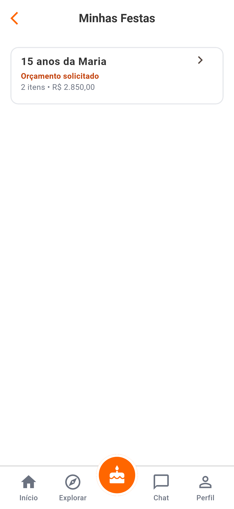
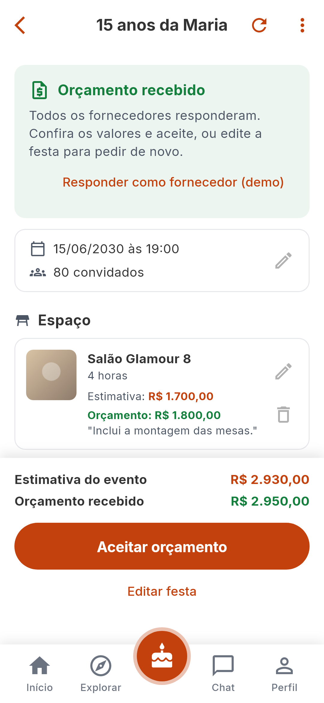
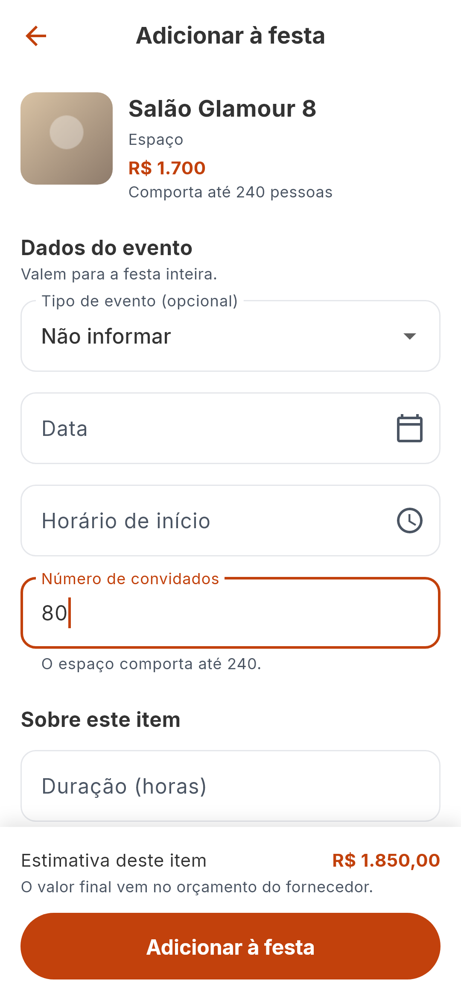
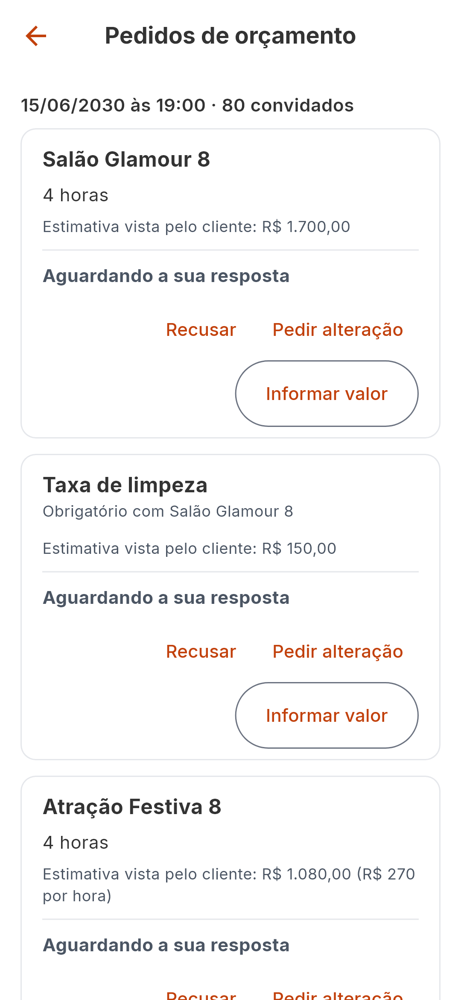

# Party Maker — telas e experiência

Tokens, componentes e regras gerais: [design-system](../../04-ux/design-system.md)
e [accessibility](../../04-ux/accessibility.md). Aqui só o que é do Party Maker.
O passo a passo de cada fluxo: [user-flows](user-flows.md).

## Telas

Todas em `lib/features/party_maker/presentation/`.

| Tela | Arquivo | Captura |
|---|---|---|
| Entrada da aba (decide o que mostrar) | `pages/party_maker_entry_page.dart` | — |
| "Minhas Festas" | `pages/my_parties_page.dart` |  |
| A festa | `pages/party_builder_page.dart` |  |
| A festa com o orçamento recebido | a mesma |  |
| Folha "Em qual festa…?" | `widgets/select_party_bottom_sheet.dart` |  |
| Configuração de um item | `pages/item_configuration_page.dart` |  |
| Dados do evento (criar e editar) | `pages/event_details_page.dart` | — |
| Histórico | `pages/party_history_page.dart` | — |
| Pedidos de orçamento (fornecedor) | `pages/quote_inbox_page.dart` |  |

Peças: `widgets/party_item_tile.dart` (um item da festa),
`widgets/partner_suggestions.dart` (os parceiros recomendados),
`widgets/event_details_fields.dart` (os campos do evento, usados na tela do
evento e dentro da configuração de um item) e `widgets/event_type_name.dart`.
Textos, ícones e cores de cada conceito ficam em `party_presentation.dart`.

As telas foram percorridas em um emulador Android em 3 de outubro de 2026; o
que foi visto, e o que não foi, está em [testing](../../01-architecture/testing.md).

## O que a pessoa sempre sabe

É o critério de desenho da tela da festa:

| Pergunta | Onde a tela responde |
|---|---|
| onde estou? | o nome da festa no título |
| em que pé está, e o que vem agora? | a faixa do topo: o status e uma frase com o próximo passo (`nextStepFor`) |
| o que já escolhi? | os itens, agrupados por categoria |
| quanto deve custar? | "Estimativa do evento", sempre no rodapé |
| quanto os fornecedores pediram? | "Orçamento recebido", em outra linha e em outra cor |
| o que falta? | a caixa "Falta para pedir o orçamento" |
| o que acontece se eu tocar? | diálogo antes de solicitar, aceitar, cancelar, apagar e remover |

## O formulário de um item

Não é um formulário gigante: cada categoria tem de dois a cinco campos, que
vêm da tabela de regras (`ItemConfigurationSpec`), e não da tela. Incluir uma
categoria não mexe na tela.

- Obrigatório não leva marca; o opcional é que diz "(opcional)".
- A validação de cada campo é a mesma regra que vale na hora de o item entrar.
- O formulário é uma coluna com rolagem, e não uma lista que monta os campos
  sob demanda: a validação só enxerga o que está montado. Ao confirmar, a tela
  rola até o primeiro campo com problema.
- Antes da primeira tentativa nenhum erro aparece. Depois de uma tentativa
  com erro, o formulário confere de novo a cada mudança (`_showErrors` liga o
  `autovalidateMode`): o erro de um campo some assim que ele é corrigido, e o
  que continua faltando continua marcado. Vale também para a tela do evento e
  para os dois diálogos do fornecedor.
- A data e o horário são **botões com cara de campo** (`PickerFormField`, em
  `core/widgets/form_widgets.dart`), e não campos de texto só de leitura: o
  Flutter não publica ação nenhuma de um campo só de leitura, e o leitor de
  tela não teria o que acionar.
- O erro e a ajuda de um campo quebram em até três linhas (tema). O rótulo
  não quebra: tem de ser curto, e o que mais houver a dizer vai na ajuda
  ("Mensagem (opcional)" + "O cliente lê junto com o valor.").
- Os dados do evento aparecem dentro do formulário só quando o item precisa
  deles, já preenchidos com o que a festa tem.

## Estimativa e orçamento, sempre separados

| | Estimativa | Orçamento |
|---|---|---|
| O que é | a conta do app com o preço do anúncio | o valor que o fornecedor informou |
| No item | "Estimativa: R$ …", com a conta ao lado quando há uma ("R$ 270 por hora") | "Orçamento: R$ …", com o recado |
| No rodapé | "Estimativa do evento", em laranja | "Orçamento recebido", em verde |
| Quando não existe | "Sob consulta", ou "R$ … + 2 sob consulta" | a linha não aparece |

## Como cada status aparece

`PartyStatusPresentation` em `party_presentation.dart`:

| Status | Texto | Cor |
|---|---|---|
| `draft`, `planning` | Rascunho, Em planejamento | `textSecondary` |
| `locked` | Orçamento solicitado | `primary` |
| `quoted` | Orçamento recebido | `success` |
| `edit_requested` | Edição solicitada | `warning` |
| `confirmed` | Orçamento aceito | `success` |
| `paid` | Pago | `success` |
| `cancelled` | Cancelado | `danger` |

A faixa do topo tem o fundo tingido na cor do status (`colors.tint`); os pares
de cor estão em `test/core/theme_contrast_test.dart`. Da segunda rodada em
diante o título diz "(2ª rodada)".

## A ação do rodapé

| Status | Botão principal | Secundário |
|---|---|---|
| em planejamento | Solicitar orçamento (desabilitado enquanto houver pendência) | — |
| orçamento solicitado, edição solicitada | Editar festa | — |
| orçamento recebido | Aceitar orçamento | Editar festa |
| orçamento aceito | Editar festa (com confirmação) | — |
| paga, cancelada | — | — |

Um botão que não pode agir fica **desabilitado**, em vez de aceitar o toque e
responder com um erro.

## Estados da tela

| Estado | O que aparece |
|---|---|
| carregando | "Carregando suas festas" |
| falha na carga, sem nada em memória | erro com "Tentar novamente" |
| falha ao atualizar, com festas na tela | as festas continuam; um aviso diz que não foi possível atualizar |
| sem nenhuma festa | "Você ainda não tem festas" + **Criar festa** + "Explorar anúncios" |
| festa sem itens | "Sua festa ainda não tem itens" + **Explorar anúncios** + "Ver os mais procurados" |
| operação em andamento | o botão do rodapé mostra o progresso; lápis e lixeiras desabilitados |
| configuração: carregando o anúncio | "Carregando …" |
| configuração: o anúncio saiu do catálogo | erro com "Tentar novamente" |
| pedidos do fornecedor: nenhum | "Nenhum pedido de orçamento" |

## A barra do topo da festa

Voltar, o nome da festa, **Atualizar a festa** e o menu **⋮** (histórico,
editar dados do evento, cancelar, apagar). São dois botões, e não mais: com
três o nome da festa era cortado.

## O botão central

A aba do Party Maker é o botão redondo no meio da barra inferior
(`PartyTabButton` em `app/widgets/app_bottom_nav_bar.dart`). Ele ocupa o lugar
do botão flutuante do `Scaffold`, e não um desenho por cima da barra: o que é
desenhado fora dos limites de um widget não recebe toques. Sobe 19 pontos
acima da barra (`AppSpacing.navButtonOverlap`), e por isso o rodapé da festa
tem essa folga a mais embaixo. Rótulo para leitor de tela: "Minhas festas".

## Avisos

| Quando | Texto |
|---|---|
| item entrou | "… adicionado a …." com o atalho "Ver festa". Sem o atalho quando a pessoa já está na festa (um parceiro recomendado): ele não levaria a lugar nenhum |
| item alterado | "… atualizado." |
| item saiu | "… removido." ou "… removido, com …." |
| orçamento solicitado | "Orçamento solicitado. As respostas dos fornecedores aparecem aqui." |
| festa liberada | "Festa liberada para edição." |
| orçamento aceito | "Orçamento aceito." |
| operação falhou | a mensagem da regra ou da falha (`controller.error`) |

O aviso fica 4 segundos por cima do rodapé; os testes esperam ele sair antes de
tocar no botão que está embaixo.

Nenhum texto promete um aviso que o app não envia. Os diálogos de aceitar e de
cancelar dizem que o aceite e o cancelamento **aparecem na lista de pedidos**
dos fornecedores, e não que eles "ficam sabendo"
([known-issues](known-issues.md), PM-1).

## Acessibilidade específica

- Todo botão de ícone diz o que ele afeta: "Alterar Salão Glamour 8", "Remover
  Salão Glamour 8", "Adicionar Decoração Encanto 8 à festa". A lixeira de um
  serviço obrigatório diz por que está desabilitada.
- O status, cada grupo de itens e cada seção do formulário são títulos para o
  leitor de tela (`Semantics(header: true)`).
- A estimativa do formulário é uma região viva: o leitor de tela anuncia quando
  ela muda.
- A data e o horário são anunciados como botões e podem ser acionados pelo
  leitor de tela (grupo "leitores de tela" de `test/app/accessibility_test.dart`).
- As telas passam nas verificações de área de toque e de rótulo, no tema claro
  e no escuro, e não estouram com a fonte em 200%
  (`test/app/accessibility_test.dart`). O rodapé e o último item ficam acima
  das barras do sistema (`test/app/system_bars_test.dart`).
- Nenhum rótulo, ajuda ou erro de campo é cortado na largura de um celular
  comum, com a fonte de verdade (`test/app/field_text_fit_test.dart`).
- A lista da festa monta os itens conforme eles entram na tela: nos testes, o
  que está mais abaixo só existe depois de rolar (`reveal` em
  `test/support/party_harness.dart`).

## Em aberto

- OPEN QUESTION: o fornecedor aparece para o cliente só como "o fornecedor".
  Não existe um nome público de fornecedor (o cadastro tem só o nome legal, que
  é dado pessoal). Vale mostrar quem é?
- `[PROPOSTA]` Avisar a pessoa quando um fornecedor responde: hoje ela precisa
  atualizar a festa.
